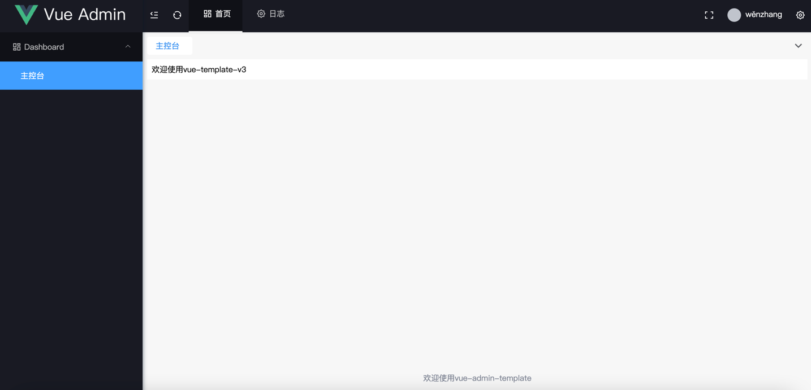
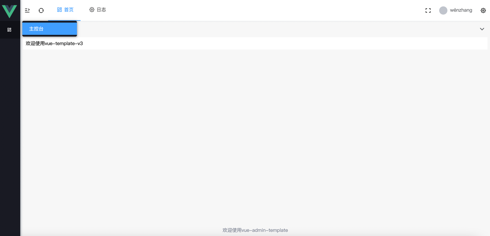

# vue3-admin-template

这是使用vue3 + element-plus 搭建的一套后台管理相关项目的模板

对标 iView Pro， 目前实现的功能有：

## 功能（Functions）
- 使用vue3最新setup语法糖，使用js语法，降低使用门槛
- 包括布局方式随意切换，可通过需求选择布局方式
- 菜单鉴权：可通过配置切换前后端鉴权方式
- 路由鉴权
- 功能鉴权： 封装鉴权指令，简化鉴权操作
- 配置文件都在setting.js中, 配有完整注释了解其作用


## 💚 适合人群
- 正在使用vue3以及想使用 element-plus 开发。
- 熟悉 Vue.js 技术栈，使用它开发过几个实际项目。
- 对实现原理技术感兴趣，想进阶和提升的同学。

## 效果图



## Project setup
```
yarn install
```

### Compiles and hot-reloads for development
```
yarn serve 

or

yarn dev
```

### Compiles and minifies for production
```
yarn build
```

### Lints and fixes files
```
yarn lint
```

### Customize configuration
See [Configuration Reference](https://cli.vuejs.org/config/).
